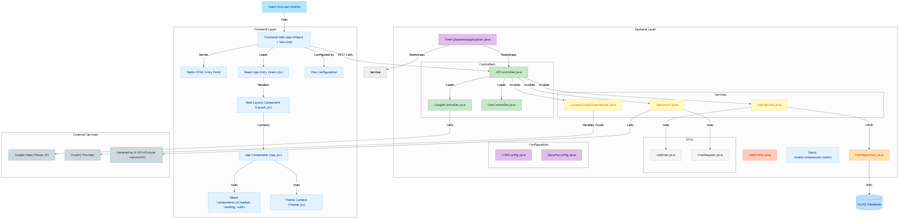

# 🚀 FireFly — Your AI Health Companion 🌟

FireFly is an intelligent, AI-powered health chatbot designed to support users in times of need. Whether you're feeling unwell, seeking reliable medical suggestions, or looking for expert guidance — **FireFly is here to help — anytime, anywhere.**

---

## 🧠 What FireFly Can Do for You

### 🔍 Symptom Checker
Describe how you're feeling — FireFly analyzes your symptoms using smart algorithms and offers personalized suggestions.

### 👨‍⚕ Doctor & Medicine Recommendations
Based on your **age**, **gender**, and **location**, FireFly suggests relevant doctors and over-the-counter medicines tailored to your current health condition.

### 🌐 Speak Your Language
FireFly supports multi-language communication. Whether it's **Bengali**, **Spanish**, **Hindi**, or any other language — type or talk in your preferred language, and FireFly will respond fluently.

### 🔒 Privacy First
Your health is personal — and we treat it that way. FireFly ensures data security with **robust backend encryption**. Your conversations stay **confidential and safe**.

Say goodbye to random website searches — let **FireFly** guide you toward better health.

---

## ✨ Why Choose FireFly?

- ✅ **AI-Driven Accuracy**
- 🌍 **Multi-Language Support**
- 🔐 **Secure & Confidential**
- 💬 **User-Friendly Chat Experience**

## 🛠 Tech Stack

| Component     | Technology                |
|---------------|----------------------------|
| **Frontend**  | React (Vite) + Tailwind CSS |
| **Backend**   | Spring Boot + Spring Security               |
| **Database**  | MySQL + PostgreSQL                     |
| **AI Layer**  | Generative AI API (Coming Soon) |

---

## 🚀 Getting Started

### 🔧 Prerequisites
- Java JDK 17+
- Maven 3.6+
- Node.js & npm
- MySQL

### 💻 Installation

### 💻 Installation

#### 🔹 Backend (Spring Boot)
```bash
# Clone the repository
git clone https://github.com/PralayeshMukherjee/FireFly
cd firefly

# Navigate to backend folder
cd backend

# Install dependencies & build
mvn clean install

# Configure Database in `application.properties`
spring.datasource.url=jdbc:mysql://localhost:3306/bookie
spring.datasource.username=root
spring.datasource.password=your_password

# Run the backend server
mvn spring-boot:run
```

#### 🔹 Frontend (React + Vite)
```bash
# Navigate to frontend folder
cd frontend

# Install dependencies
npm install

# Start development server
npm run dev
```

📌 The frontend runs on `http://localhost:5173` and backend on `http://localhost:8080`.

---

## 🏆 Contributing

Contributions are welcome! 🎉 Feel free to fork the repository, create a new branch, and submit a pull request.

1. Fork the project
2. Create a feature branch (`git checkout -b feature-newFeature`)
3. Commit changes (`git commit -m 'Added a new feature'`)
4. Push to branch (`git push origin feature-newFeature`)
5. Open a pull request

---

## 📝 License
This project is licensed under the MIT License. See the [LICENSE](LICENSE) file for details.

---

## 📩 Contact
🔗 **GitHub**: [PralayeshMukherjee](https://github.com/PralayeshMukherjee)  
🔗 **LinkedIn**: [Connect with me](https://www.linkedin.com/in/pralayesh-mukherjee-756a8b276/)  
💡 Have suggestions? Let's innovate together! 🚀📚

## 🌍 Architecture Diagram


